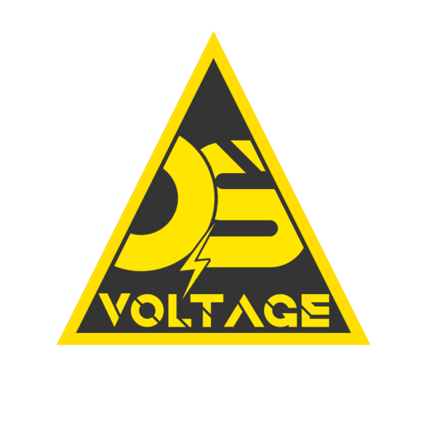

<p align="center">
  
</p>

# VoltageOS
## How to build
#### Initiate VoltageOS
```bash
mkdir voltageos
cd voltageos
repo init -u https://github.com/VoltageOS/manifest.git -b 16 --git-lfs
```
#### Clone the treble manifest
```bash
git clone https://github.com/itisFarzin/treble_manifest .repo/local_manifests -b voltageos-16
```
#### Sync
```bash
repo sync -j$(nproc)
```
#### Clone this repo
```bash
git clone https://github.com/itisFarzin/VoltageOS_GSI -b 16
```
#### Apply patches
```bash
cp -r VoltageOS_GSI/patches .
bash patches/apply-patches.sh .
```
#### Build
```bash
source build/envsetup.sh
breakfast gsi userdebug
m -j$(nproc) systemimage
```
## Compression
```bash
xz -vc -T0 out/target/product/tdgsi_arm64_ab/system.img > system.img.xz
```
